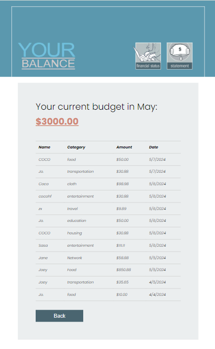
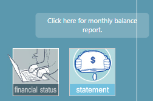
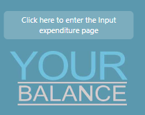

# 'YOUR BALANCE' APP

A simple single-page application that helps family members manage and track monthly budgets and expenses to ensure they do not exceed the set budget limits.

There are four main pages where users can:
1,Set and edit the monthly budget at any time;
2,Add, view, edit, and delete expenses for the current month;
3,View the monthly financial report at any time.
It is a good tool for maintaining family financial balance.

## SET UP

The app includes both a frontend and backend API:

1, The frontend uses React.js and SCSS;
2, The backend uses Node.js and Express;
3, The database utilizes MySQL and Knex.js;
4, It features Responsive Design and is a Single Page Application (SPA).

To run this APP, you need open both client and API server. input 'npm start' running server first, then use 'npm start' running client.

To set up, just need:
In VS Code, open 'YOUR BALANCE', input commond in the integrated termial:

'npm install
 cd client
 npm install
 cd ..
 cd server
 npm install'

### Backend

This APP built database by MySQL Database system, you need install MySQL Workbench, and Knex. 
To setup, open your terminal, and commond
'mysql -r root -p'

### Mockup

